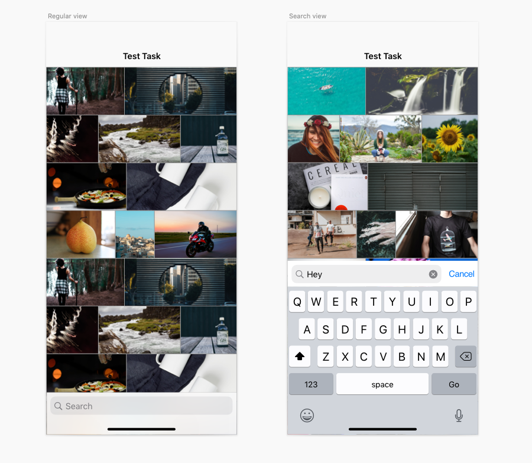

# Задача
Сделать одноэкранное приложение с поиском и показом GIF в виде коллекции.

# Описание
Основная часть.
Необходимо реализовать одноэкранное приложение с поиском и показом GIF в виде коллекции (не менее двух столбцов).
Приложение должно быть написано на objective-c без использования storyboard.
Использовать можно любой API, например https://developers.giphy.com/docs/api/endpoint
Также можно использовать любые сторонние фреймворки для сетевых взаимодействий, проигрывания GIF анимаций.

Осуществление сетевых запросов:
Динамичный поиск, т.е. начиная с двух символов и далее поиск происходит автоматически при любом изменении ввода
Проигрывание GIF анимаций

Дополнительная часть.
В приложенном файле нарисован специфичный дизайн для коллекции. Суть его в том чтобы показать как можно больше контента с минимальным обрезанием по краям.

